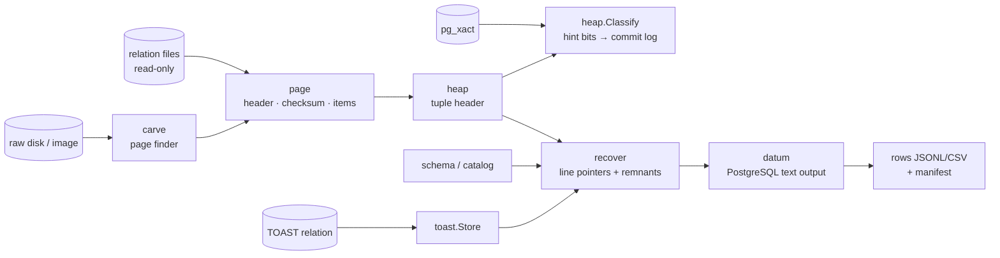

# Architecture

```text
cmd/pagerelic          signal handling -> cli.Run
internal/cli           commands, flags, output (JSONL/CSV + SHA-256 manifest), exit codes
internal/catalog       pg_filenode.map, self-bootstrapped pg_attribute, pg_class/pg_namespace/pg_database
internal/recover       page scan: line-pointer decoding, remnant carving, confidence, stale-copy removal
internal/carve         raw-media page finder, grouping, checksum block inference
internal/toast         TOAST chunk index and value reassembly
internal/datum         varlena, pglz, LZ4, type output functions, built-in type table
internal/heap          tuple header, infomask, MVCC classification
internal/xact          pg_xact reader
internal/page          page header, line pointers, special-space kind, data checksum
internal/relation      segment-aware read-only relation files
internal/schema        column layouts (spec parser)
internal/fixture       loads testdata/pg17 (tests only)
```



## Design decisions

**Offline and read-only.** PageRelic never talks to a server and opens
every input with `os.Open`. Recovery must work when PostgreSQL can't start,
and must never alter the evidence.

**PostgreSQL is the oracle.** Every decoder is tested against real files and
compared with PostgreSQL's own `pageinspect` and output-function results
(`testdata/pg17/key`). Synthetic tests only cover shapes a real cluster
can't easily produce (corruption, edge values) and fuzzing.

**Every tuple version, classified, never filtered by default.** A forensic
tool has to show deleted, updated, aborted and in-progress versions, not
only what a `SELECT` would see. State comes from hint bits first, then
`pg_xact`. When neither is available the state is `unknown`, never guessed.

**Remnants are strict.** A carved tuple must have a valid header, an
attribute count that fits the schema, a plausible xmin, and every attribute
decoding without error. Exact duplicates of referenced tuples are dropped.
Unreferenced tuples whose headers look live are reported as `superseded`.
The acceptance bar comes from measurement: zero false positives on the
real fixtures (docs/research/findings.md).

**Confidence is explicit.** `high`: referenced by a line pointer on a page
whose checksum verifies. `medium`: a remnant that decoded cleanly. `low`:
checksum mismatch, or a tuple that didn't fully match the layout.

**Version-independent catalogs.** `pg_attribute`'s layout is derived from
its self-describing rows and verified, rather than hard-coded per version.

**Bounded work on hostile bytes.** Slices are bounds-checked before use.
Declared sizes are never trusted for allocation (TOAST sizes, array
dimensions and decompressed lengths are capped). Decompressors reject
back-references before the output start. Every parser has a fuzz target.

**Plan for scale.** Relations are streamed page by page. The TOAST index
holds chunk data in memory (bounded by the TOAST relation's size), and
catalog decoding holds catalog rows only.
